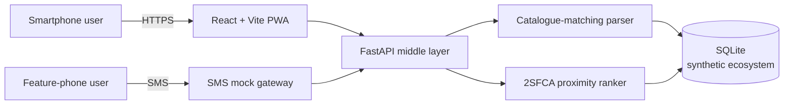

# Afia

A middle-layer pharmaceutical access platform for markets where digital maturity is currently near zero. Couples a Progressive Web App (PWA) for smartphone users with an SMS interface for feature-phone users, over a shared backend search API. Designed to operate today via a grounded synthetic pharmacy ecosystem, extensible to real pharmacy APIs as they emerge.

**Context:** MSc Advanced Computer Science dissertation, Queen Mary University of London. Deadline: 19 August 2026.

## Contributions

1. Empirical characterisation of pharmacy digital maturity in Conakry, based on a systematic scan of 15 pharmacies.
2. Middle-layer platform architecture for markets where digital maturity is near zero.
3. Dual-channel (PWA + SMS) access design with a lightweight NLP catalogue-matching parser.
4. Grounded synthetic evaluation approach for a Conakry pharmacy ecosystem.

## Ethics constraint

**Synthetic data only.** EECS DSREC approval granted 4 July 2026 on the condition that no real patient, user, or pharmacy operational data is collected or processed during this project. The synthetic ecosystem is programmatically generated and grounded in the digital-maturity scan; no real inventory or user data flows through the system.

## Architecture



## Stack

- **Backend:** Python 3.11+, FastAPI, SQLite, SQLAlchemy
- **Frontend:** React 18, Vite, TypeScript, Tailwind (or CSS Modules, TBD after Figma inspection)
- **SMS:** local mock (Python module simulating SMS gateway; no external SMS provider)
- **Data:** synthetic pharmacy ecosystem generated from the Conakry digital-maturity scan
- **Deployment:** local demo only; submission includes video walkthrough

## Repository layout

```
afia/
├── backend/               FastAPI middle-layer service
│   ├── app/
│   │   ├── api/           HTTP route handlers
│   │   ├── models/        SQLAlchemy models
│   │   ├── services/      Business logic (parser, ranker, SMS mock)
│   │   └── data/          Synthetic data generation scripts
│   └── tests/             Pytest suite
├── frontend/              React + Vite PWA
│   ├── src/
│   │   ├── components/    Reusable UI components (mirror Figma)
│   │   ├── pages/         Route-level screens
│   │   ├── lib/           API client, utilities
│   │   └── styles/        Tokens, global CSS
│   └── public/            Static assets, PWA manifest
├── data/
│   ├── scan/              Anonymised digital-maturity scan (15 pharmacies)
│   └── synthetic/         Generated synthetic ecosystem (versioned)
├── docs/                  Architecture notes, decision log, evaluation protocol
└── scripts/               Dev utilities (data generation, seeding, mock SMS CLI)
```

## MVP scope (critical path only)

Three screens implemented from the Figma design:
1. Landing / search entry
2. Search results (ranked pharmacy list with stock indication)
3. Pharmacy detail card

All other Figma screens (onboarding, profile, favourites, notifications, offline UX) are designed but documented as **not implemented for MVP, future work**. This is a deliberate DSR scope decision to protect evaluation and write-up time.

## Development

```bash
# Backend
cd backend
python3 -m venv .venv
source .venv/bin/activate
pip install -r requirements.txt
uvicorn app.main:app --reload

# Frontend
cd frontend
npm install
npm run dev

# SMS mock CLI (send test messages)
python scripts/sms_mock.py "Where can I find paracetamol?"
```

## Evaluation

Doctor-in-the-Loop (DITL) qualitative evaluation against scripted scenarios on the synthetic Conakry ecosystem. Documented in `docs/evaluation_protocol.md` (to be written during eval phase).

## References

Related Work section of the dissertation covers pharmaceutical accessibility in LMICs, geospatial approaches, mHealth/SMS interventions, and synthetic evaluation methodology. Full reference list in the dissertation.
